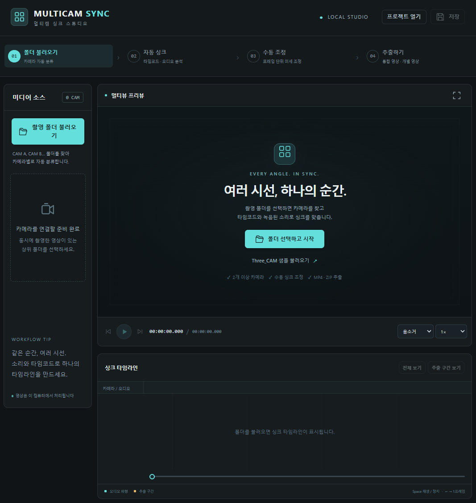
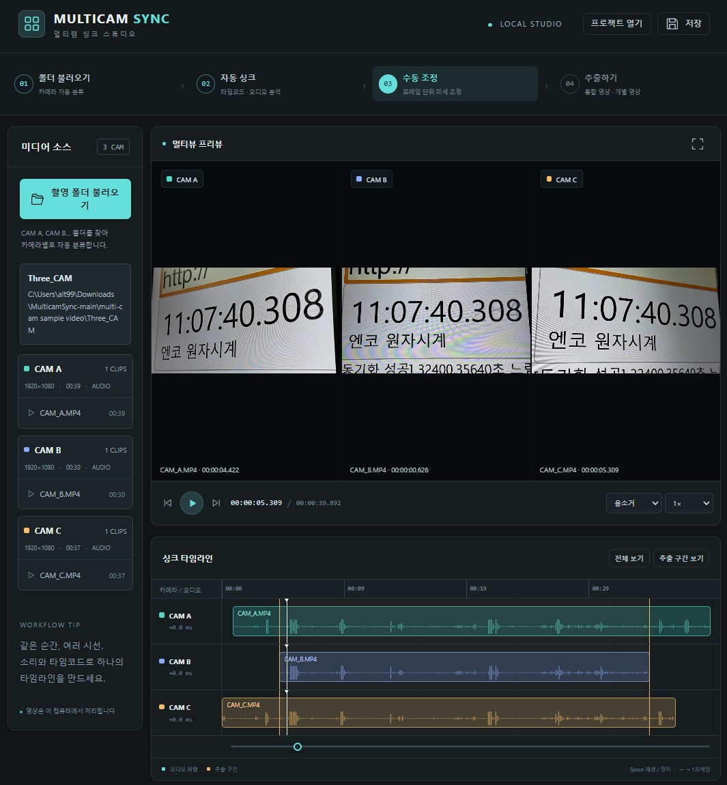

# Multicam Sync

A Windows program that plays footage from multiple cameras in sync, then exports it as a combined layout or as per-camera clips in MP4.



## Running

**Fully extract** the distribution ZIP, then double-click `실행.cmd` (Run). The workspace opens in your default browser. No separate Python or FFmpeg installation is required. All video processing happens locally on this PC. `실행.vbs` is an alternative launcher that starts without a console window.

Keep the `runtime`, `bin`, and `static` folders together with the Python files in the same location. Closing the browser window does not stop the program; launching it again reopens the same workspace. Use **Quit Program** at the top of the screen to exit.

## 1. Load a Shoot Folder



Click **Select Folder** or paste a folder path. Select the parent folder that contains all cameras. The bundled example is `multi-cam sample video/Three_CAM`; **Load Three_CAM sample** on the welcome screen opens it from that relative path.

```
Shoot folder/
  CAM A/  clip1.MP4, clip2.MP4, ...
  CAM B/  clip1.MP4, clip2.MP4, ...
  CAM C/  ...
```

The number of cameras is inferred from names such as `CAM A`, `CAM B`, and `CAM C`. Multiple clips from the same camera are shown on a single track, with recording gaps preserved. If no CAM names are found, clips are grouped by subfolder, and individual files at the top level are each treated as a separate camera. DJI `.LRF` files are not double-counted with their original videos.

## 2. Auto Sync

After loading a folder, **Auto Sync → Preview Preparation** runs automatically. The default Auto mode references recording time and timecode, and compares multiple segments of recorded audio.

- **Auto / Audio:** Computes the time offset from how well multiple audio segments match.
- **Timecode:** Uses embedded SMPTE timecode. The cameras' timecode clocks must be synchronized.
- Clips with no audio or a weak match are marked **Unconfirmed**. Clips temporarily placed by recording time require manual verification.
- Confidence reflects the degree of match found by the analysis. It is not a probability that guarantees actual frame accuracy.

Previews are generated as lightweight H.264 video, so HEVC originals can also be viewed in the browser. Initial analysis and preview preparation take time proportional to footage length; subsequent sessions reuse the cache.

## 3. Manual Adjustment

Use the global play button and timeline to view all cameras at the same point in time. Selecting a common recording segment jumps to a section that all cameras captured together.

- Adjust each camera's time by entering a number or using the **±1 frame / ±100 ms** buttons.
- **A positive value moves that camera later on the timeline**; a negative value moves it earlier.
- If only a specific clip is off, adjust that clip's individual start time.
- Re-running Auto Sync resets manual corrections. Save the project JSON first if needed.
- Browser preview may momentarily show frame differences depending on performance. The final export is rendered on a shared frame count.

Saving a project stores source paths and sync information. Source videos are not copied, so if you move the originals, reload the folder.

## 4. Export

Set the start and end points, then choose an output mode.


| Option     | Result                                                 |
| ---------- | ------------------------------------------------------ |
| Combined   | One MP4 with all cameras merged in the selected layout |
| Individual | Per-camera MP4s trimmed to the same time range         |
| Both       | Both the combined MP4 and individual MP4s              |


You can choose horizontal, vertical, grid, or picture-in-picture (PIP) layouts, as well as camera order. In PIP, the first camera is the main view and the others appear as small views on the right. Audio for the combined video comes from one selected camera, or can be muted. Each individual video keeps its own camera's audio.

By default, individual videos are saved at the resolution of the largest source video for each camera. Even if resolutions differ between cameras, output FPS and time range are identical. The selected output resolution applies to the combined video. Source aspect ratios are preserved with black padding, and periods with no recording are filled with black frames and silence. When clips from the same camera overlap, the one that starts first takes priority. Export ranges are snapped to frame boundaries at the selected FPS.
[사용설명서.md](https://github.com/user-attachments/files/32270334/default.md)

When finished, download results from the screen or find them in the **exports** folder inside the program folder. Each export folder contains the videos along with the project and settings JSON used.

## Current Support

Windows 64-bit, minimum of 2 cameras. Reads MP4, MOV, MKV, AVI, MTS, M2TS, MXF, WEBM, and M4V. Output is H.264/AAC MP4. Working with dozens of cameras or long high-resolution footage simultaneously depends on the PC's memory and CPU. Audio auto sync corrects a **fixed time offset per clip**; it does not automatically stretch or compress for speed differences (drift) that occur during long recordings.

## Source Code

The program consists of `app.py`, `media_engine.py`, and `export_engine.py` in the program folder, plus HTML/CSS/JavaScript in the `static` folder. It runs directly on the bundled Python runtime; PyInstaller is not required. FFmpeg documentation: [Filters, compositing, and timing](https://ffmpeg.org/ffmpeg-filters.html). For licensing and distribution details, see `THIRD_PARTY_NOTICES.md`.d…]()


# Multicam Sync

여러 카메라의 영상을 같은 시점에 재생하고, 화면을 합치거나 카메라별로 잘라 MP4로 저장하는 Windows 프로그램입니다.


## 실행

배포 ZIP을 **모두 압축 해제**한 뒤 `실행.cmd`를 더블클릭하세요. 기본 브라우저에 작업 화면이 열립니다. Python이나 FFmpeg를 따로 설치할 필요가 없습니다. 영상 처리는 이 PC에서 이루어집니다. `실행.vbs`는 검은 창 없이 시작하는 대체 실행 파일입니다.

`runtime`, `bin`, `static` 폴더와 같은 위치의 Python 파일을 함께 보관하세요. 브라우저 창만 닫으면 프로그램은 실행 중이며, 다시 실행하면 같은 작업 화면이 열립니다. 화면 위의 **프로그램 종료**로 종료할 수 있습니다.

## 1. 촬영 폴더 불러오기


**폴더 선택**을 누르거나 폴더 경로를 붙여넣습니다. 여러 카메라를 담은 상위 폴더를 선택하세요. 저장소에 포함된 예시는 `multi-cam sample video/Three_CAM`이며, 시작 화면의 **Three_CAM 샘플 불러오기**로 상대경로에서 바로 열 수 있습니다.

```
촬영 폴더/
  CAM A/  영상1.MP4, 영상2.MP4, ...
  CAM B/  영상1.MP4, 영상2.MP4, ...
  CAM C/  ...
```

`CAM A`, `CAM B`, `CAM C` 등의 이름으로 카메라 수를 추정합니다. 같은 카메라의 여러 영상은 한 트랙에 표시하며 촬영 중단 구간을 유지합니다. CAM 이름이 없으면 하위 폴더별로 묶고, 최상위의 개별 파일은 각각 카메라로 취급합니다. DJI의 `.LRF`는 원본 영상과 중복 집계하지 않습니다.

## 2. 자동 싱크

폴더를 불러오면 **자동 싱크 → 미리보기 준비**가 진행됩니다. 기본 자동 모드는 촬영 시각·타임코드를 참고하고 녹음된 소리의 여러 구간을 비교합니다.

- **자동 / 오디오:** 여러 오디오 구간의 일치 여부로 시간차를 계산합니다.
- **타임코드:** 임베디드 SMPTE 타임코드를 사용합니다. 카메라의 타임코드 시계가 맞아 있어야 합니다.
- 소리가 없거나 일치가 약한 영상은 **미확정**으로 표시합니다. 촬영 시각에 임시 배치된 영상은 수동 확인이 필요합니다.
- 신뢰도는 분석상 일치 정도를 나타내며, 실제 프레임 정확도를 보증하는 확률은 아닙니다.

미리보기는 가벼운 H.264 영상으로 준비합니다. 원본이 HEVC인 경우도 브라우저에서 볼 수 있습니다. 최초 분석·미리보기 준비에는 영상 길이에 비례해 시간이 걸리며, 다음 작업부터는 캐시를 재사용합니다.

## 3. 수동 조정

전체 재생 버튼과 타임라인으로 모든 카메라를 같은 시점에서 봅니다. 공통 촬영 구간을 선택하면 카메라들이 함께 촬영한 부분으로 이동할 수 있습니다.

- 카메라별 시간을 숫자로 입력하거나 **±1프레임 / ±100ms** 버튼으로 조정합니다.
- **양수는 해당 카메라를 타임라인에서 뒤로**, 음수는 앞으로 이동합니다.
- 특정 클립만 다르면 클립의 개별 시작 시각을 조정합니다.
- 자동 싱크를 다시 실행하면 수동 보정이 초기화됩니다. 필요하면 먼저 프로젝트 JSON을 저장하세요.
- 브라우저 미리보기는 성능에 따라 순간적으로 프레임 차이가 날 수 있습니다. 최종 추출 영상은 공통 프레임 수로 렌더링됩니다.

프로젝트 저장은 원본 경로와 싱크 정보를 보관합니다. 원본 영상 자체를 복사하지 않으므로, 원본을 옮겼다면 폴더를 다시 불러오세요.

## 4. 추출

시작·종료 시점을 정하고 출력 방법을 선택합니다.


| 옵션  | 결과                        |
| --- | ------------------------- |
| 통합  | 모든 카메라를 선택한 배치로 합친 MP4 1개 |
| 개별  | 같은 시간 범위로 자른 카메라별 MP4     |
| 둘 다 | 통합 MP4와 개별 MP4 모두         |


가로·세로·격자·화면 속 화면(PIP) 배치와 카메라 순서를 선택할 수 있습니다. PIP는 첫 카메라가 큰 화면, 나머지가 오른쪽 작은 화면입니다. 통합 영상의 소리는 선택한 카메라 한 대 또는 무음으로 저장합니다. 개별 영상에는 각 카메라의 소리가 들어갑니다.

개별 영상은 기본적으로 카메라별 가장 큰 원본 영상의 해상도로 저장합니다. 카메라별 해상도가 달라도 출력 FPS와 시간 범위는 같습니다. 통합 영상에는 선택한 출력 해상도를 적용합니다. 원본 비율을 유지하며 남는 부분에는 검은 여백을 넣고, 촬영이 없는 시간은 검은 화면·무음으로 채웁니다. 같은 카메라에서 클립이 겹치면 먼저 시작한 클립을 우선합니다. 추출 구간은 선택한 FPS에 맞춰 프레임 경계로 조정됩니다.

완료 후 화면에서 다운로드하거나 프로그램 폴더의 **exports** 폴더에서 결과를 찾을 수 있습니다. 각 추출 폴더에는 영상과 사용한 프로젝트·설정 JSON이 저장됩니다.

## 현재 지원 범위

Windows 64비트, 카메라 최소 2대. MP4·MOV·MKV·AVI·MTS·M2TS·MXF·WEBM·M4V를 읽습니다. 출력은 H.264/AAC MP4입니다. 수십 대·장시간 고해상도 동시 작업은 PC 메모리와 CPU 성능에 영향을 받습니다. 오디오 자동 싱크는 **클립별 고정 시간차**를 보정하며, 장시간 촬영 중 발생하는 속도 차이(드리프트)를 자동으로 늘이거나 줄이지 않습니다.

## 개발 소스

프로그램 폴더의 `app.py`, `media_engine.py`, `export_engine.py`와 `static` 폴더의 HTML/CSS/JavaScript로 구성됩니다. 포함된 Python 런타임으로 직접 실행하며 PyInstaller는 필요하지 않습니다. FFmpeg 문서: [필터·합성·시간 처리](https://ffmpeg.org/ffmpeg-filters.html). 라이선스와 배포 구성은 `THIRD_PARTY_NOTICES.md`를 참고하세요.
